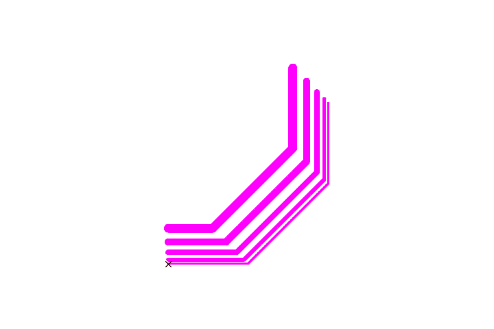

# gcoder

## Overview

The `gcoder` Go package can be used to generate g-code for the
Snapmaker A350 device. This is all part of a project to make
operations on that device fully scriptable. Using this package, one
can make g-code files runnable on the device, either through the
Snapmaker official software, or a tool like
[`snappy`](https://zappem.net/pub/project/snappy).

## Example

The `examples` directory contains an example of using this
[`zappem.net/pub/io/gcoder`](https://zappem.net/pub/io/gcoder)
package. When run as follows,

```
$ go run examples/stripes.go
2025/07/05 22:08:25 generated "stripes.nc" and "stripes.nc.png"
```

it generates a `stripes.nc` g-code file for use with the Snapmaker,
and a PNG image file:



This is the image of what is rastered by the 1.6W Snapmaker A350 laser
device when running the generated `stripes.nc` g-code file. Note: the
small red/black X mark(s) in the bottom left of that image refer to
the expected work origin position. The red mark (obscured by the black
one in this case) marks the work origin at the start of running the
job, and the black one is the work origin at the end of the job. For
jobs that change the work origin, these two marks will differ in
location.

## Plans

Only bug fixes as needed.

## Reporting bugs

The `gcoder` package has been developed purely out of self-interest
and offers no guarantee of fixes or support. That being said, if you
would like to suggest a feature addition or suggest a fix, please use
the [bug tracker](https://github.com/tinkerator/gcoder/issues).

## License information

See the [LICENSE](LICENSE) file: the same BSD 3-clause license as that
used by [golang](https://golang.org/LICENSE) itself.
